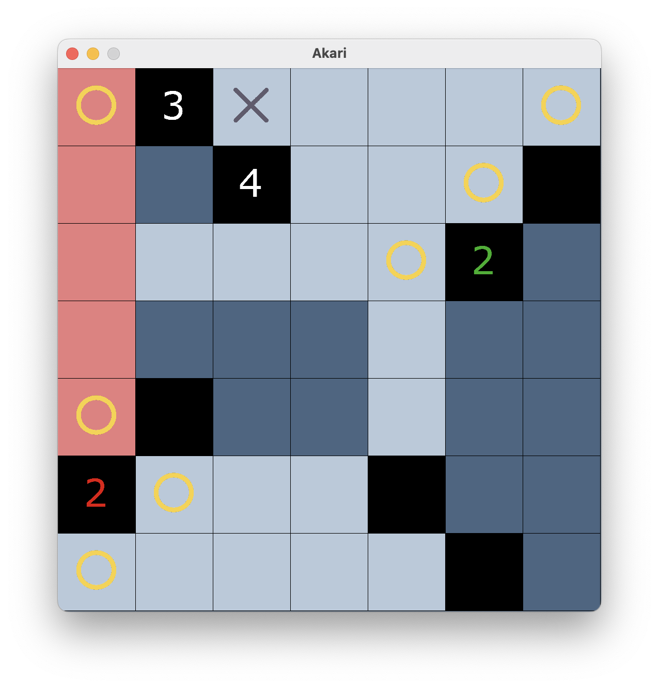

<div align="center">
    <h1>Akari</h1>
</div>
[](https://forthebadge.com)
[![forthebadge](data:image/svg+xml;base64,PHN2ZyBkYXRhLXYtM2M4N2I3YjQ9IiIgeG1sbnM9Imh0dHA6Ly93d3cudzMub3JnLzIwMDAvc3ZnIiB3aWR0aD0iMjA5LjA5OTk5ODQ3NDEyMTEiIGhlaWdodD0iMzUiIHZpZXdCb3g9IjAgMCAyMDkuMDk5OTk4NDc0MTIxMSAzNSIgY2xhc3M9ImJhZGdlLXN2ZyI+PGRlZnMgZGF0YS12LTNjODdiN2I0PSIiPjwhLS0tLT48IS0tLS0+PCEtLS0tPjwvZGVmcz48cmVjdCBkYXRhLXYtM2M4N2I3YjQ9IiIgd2lkdGg9IjEwMy4wOTk5OTg0NzQxMjExIiBoZWlnaHQ9IjM1IiBmaWxsPSIjMzFjNGYzIi8+PHJlY3QgZGF0YS12LTNjODdiN2I0PSIiIHg9IjEwMy4wOTk5OTg0NzQxMjExIiB3aWR0aD0iMTA2IiBoZWlnaHQ9IjM1IiBmaWxsPSIjMzg5QUQ1Ii8+PCEtLS0tPjx0ZXh0IGRhdGEtdi0zYzg3YjdiND0iIiB4PSI1MS41NDk5OTkyMzcwNjA1NSIgeT0iMTcuNSIgZHk9IjAuMzVlbSIgZm9udC1zaXplPSIxMiIgZm9udC1mYW1pbHk9IlJvYm90bywgc2Fucy1zZXJpZiIgZmlsbD0iI2ZmZmZmZiIgdGV4dC1hbmNob3I9Im1pZGRsZSIgbGV0dGVyLXNwYWNpbmc9IjIiIGZvbnQtd2VpZ2h0PSI2MDAiIGZvbnQtc3R5bGU9Im5vcm1hbCIgdGV4dC1kZWNvcmF0aW9uPSJub25lIiBmaWxsLW9wYWNpdHk9IjEiIGZvbnQtdmFyaWFudD0ibm9ybWFsIiBzdHlsZT0idGV4dC10cmFuc2Zvcm06IHVwcGVyY2FzZTsiPkJVSUxUIEZPUjwvdGV4dD48ZyBkYXRhLXYtM2M4N2I3YjQ9IiIgdHJhbnNmb3JtPSJ0cmFuc2xhdGUoMTEzLjA5OTk5ODQ3NDEyMTEsIDkuNSkgc2NhbGUoMC42NjY2NjY2NjY2NjY2NjY2KSI+PHBhdGggZGF0YS12LTNjODdiN2I0PSIiIGQ9Ik0xMi4xNTIgNi44OTZjLS45NDggMC0yLjQxNS0xLjA3OC0zLjk2LTEuMDQtMi4wNC4wMjctMy45MSAxLjE4My00Ljk2MSAzLjAxNC0yLjExNyAzLjY3NS0uNTQ2IDkuMTAzIDEuNTE5IDEyLjA5IDEuMDEzIDEuNDU0IDIuMjA4IDMuMDkgMy43OTIgMy4wMzkgMS41Mi0uMDY1IDIuMDktLjk4NyAzLjkzNS0uOTg3IDEuODMxIDAgMi4zNS45ODcgMy45Ni45NDggMS42MzctLjAyNiAyLjY3Ni0xLjQ4IDMuNjc2LTIuOTQ4IDEuMTU2LTEuNjg4IDEuNjM2LTMuMzI1IDEuNjYyLTMuNDE1LS4wMzktLjAxMy0zLjE4Mi0xLjIyMS0zLjIyLTQuODU3LS4wMjYtMy4wNCAyLjQ4LTQuNDk0IDIuNTk3LTQuNTU5LTEuNDI5LTIuMDktMy42MjMtMi4zMjQtNC4zOS0yLjM3Ni0yLS4xNTYtMy42NzUgMS4wOS00LjYxIDEuMDl6TTE1LjUzIDMuODNjLjg0My0xLjAxMiAxLjQtMi40MjcgMS4yNDUtMy44My0xLjIwNy4wNTItMi42NjIuODA1LTMuNTMyIDEuODE4LS43OC44OTYtMS40NTQgMi4zMzgtMS4yNzMgMy43MTQgMS4zMzguMTA0IDIuNzE1LS42ODggMy41NTktMS43MDEiIGZpbGw9IiNGRkZGRkYiLz48L2c+PHRleHQgZGF0YS12LTNjODdiN2I0PSIiIHg9IjE2Ni4wOTk5OTg0NzQxMjExIiB5PSIxNy41IiBkeT0iMC4zNWVtIiBmb250LXNpemU9IjEyIiBmb250LWZhbWlseT0iTW9udHNlcnJhdCwgc2Fucy1zZXJpZiIgZmlsbD0iI0ZGRkZGRiIgdGV4dC1hbmNob3I9Im1pZGRsZSIgZm9udC13ZWlnaHQ9IjkwMCIgbGV0dGVyLXNwYWNpbmc9IjIiIGZvbnQtc3R5bGU9Im5vcm1hbCIgdGV4dC1kZWNvcmF0aW9uPSJub25lIiBmaWxsLW9wYWNpdHk9IjEiIGZvbnQtdmFyaWFudD0ibm9ybWFsIiBzdHlsZT0idGV4dC10cmFuc2Zvcm06IHVwcGVyY2FzZTsiPk1BQyBPUzwvdGV4dD48IS0tLS0+PC9zdmc+)](https://forthebadge.com)

This is an implementation of the puzzle [Akari](https://en.wikipedia.org/wiki/Light_Up_(puzzle)) in C++.

In an Akari Puzzle, the goal is to place light bulbs on a grid so all purple squares are lit.
* A light bulb lights up asll the purple squares in its row and column until blocked by a wall.
* No light bulb may light up another light bulb.

# Screenshots 
<div align="center">
    
</div>

# Features
* Automatic win detection
* X-out cells
* Support for custom levels with JSON

# How To Build

```shell
cmake -DCMAKE_OSX_SYSROOT=$(xcrun --show-sdk-path) \
      -DCMAKE_C_COMPILER=$(xcrun --find clang) \
      -DCMAKE_CXX_COMPILER=$(xcrun --find clang++) \
      -DCMAKE_CXX_FLAGS="-I$(xcrun --show-sdk-path)/usr/include/c++/v1" \
      -B build
cmake --build build --parallel
```
